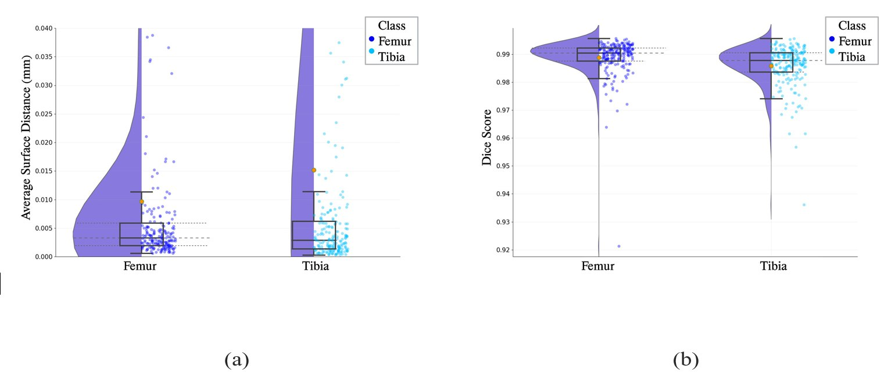
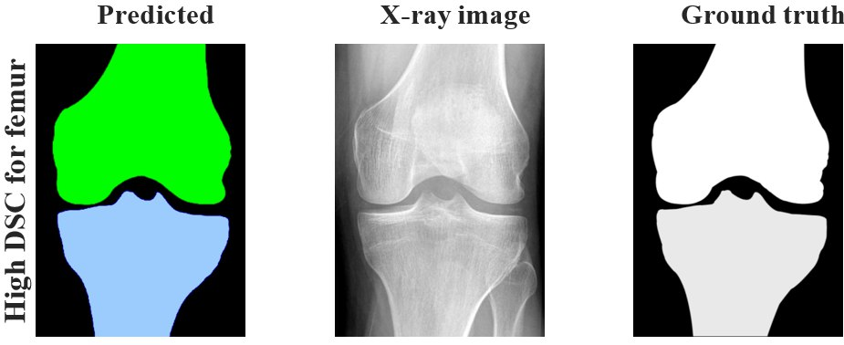

# X-ray Bone Segmentation

This repository contains the code and model for deep learning-based segmentation of knee bones from X-ray images. This segmentation model is a part of the methodology outlined in the paper entitled "Deep learning based detection of osteophytes in radiographs and magnetic resonance imagings of the knee using 2D and 3D morphology".

## Results

Considering the pixel spacing with a range between 0.20 and 0.40, the results indicate that our model was able to segment the bone boundaries with very high accuracy. 

- The segmentation model achieved an ASD of 0.01 ± 0.02 mm for femur and 0.02 ± 0.08 mm for tibia.
- The DSC scores were 98.88 ± 0.01 for femur and 98.59 ± 0.01 for tibia.

These values indicate a very high degree of similarity between the predicted and ground truth masks (Figure. 1)

Figure.1: Segmentation quality metrics for femur and tibia. (a) Average Surface Distance. (b) Dice Score. 

Figure 2 illustrates a sample of the automatic segmentation results.

Figure.2: A segmentation sample. 

